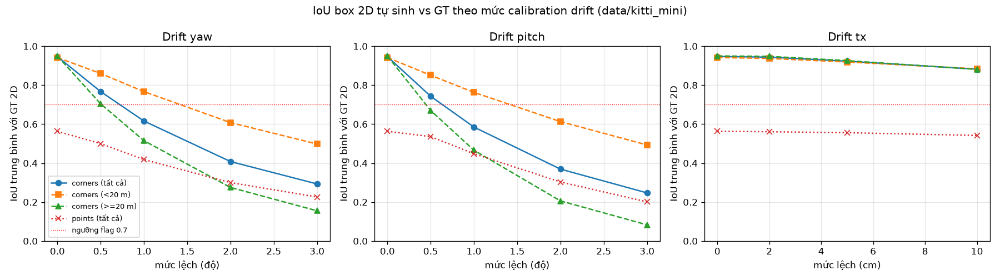
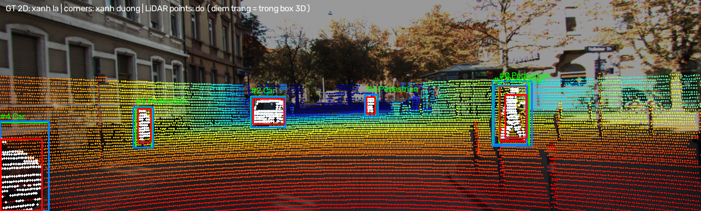
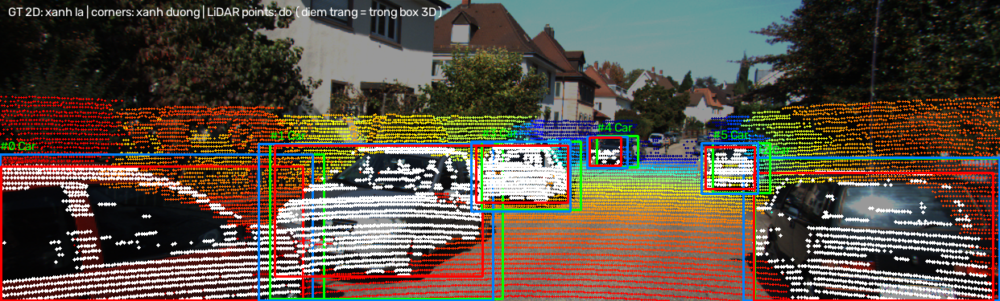

# Báo cáo Day 6: Auto-label 2D box từ box 3D và điểm LiDAR, độ nhạy với calibration drift

- **Họ tên:** Đặng Hữu Tâm
- **MSSV:** 2A202602940
- **Lớp:** [ĐIỀN]
- **Link repo:** https://github.com/tam253211-a11y/DangHuuTam-2A202602940-Track4-Day21
- **Topic:** F — Auto-label support
- **Dataset:** data/kitti_mini (thí nghiệm chính), data/nuscenes_mini_subset (so sánh, bonus B5), data/synthetic (test CP2)
- **Các frame đã dùng:** toàn bộ 20 frame kitti_mini (000001 … 000061, 115 object), toàn bộ 80 keyframe nuScenes (scene-0103_000 … scene-1094_039, 1193 object)

## 1. Claim

Trên KITTI, 2D box sinh bằng cách chiếu 8 góc box 3D khớp label người vẽ với **IoU trung bình 0.95**, tốt hơn hẳn cách lấy min/max điểm LiDAR trong box (0.56). Nhưng nó rất nhạy với lệch góc: **lệch yaw 1° làm IoU trung bình tụt còn 0.62, vật ≥ 20 m còn 0.52**. Với ngưỡng "trung vị IoU của frame < 0.7", hệ thống gắn cờ **70% frame**, còn dịch ngang 10 cm chỉ gắn cờ 10% frame.

## 2. Evidence

**Bảng 1. Hai cách sinh 2D box so với GT (KITTI, calib đúng, 115 object)** (`results/f_iou_summary_kitti.csv`)

| Nhóm | n | IoU corners (TB) | IoU points (TB) | points không tạo được box |
|---|---|---|---|---|
| Tất cả | 115 | **0.933** | 0.562 | 6.1% |
| < 15 m | 33 | 0.941 | 0.746 | 0% |
| 30–50 m | 29 | 0.948 | 0.440 | 10.3% |
| > 50 m | 13 | 0.965 | 0.294 | 30.8% |
| occluded = 2 | 23 | 0.957 | 0.370 | 17.4% |
| Pedestrian | 18 | 0.733 | 0.646 | 0% |

Box từ points luôn **nhỏ hơn** GT. Lý do: LiDAR quét theo từng tia rời rạc, chỉ thấy mặt đối diện, và lớp 10 cm sát mặt đường bị bỏ. Cách points chỉ thắng ở Pedestrian (33% object), vì box 3D của người rộng hơn thân người.

**Bảng 2. Calibration drift (110 object có IoU corners ≥ 0.7 khi calib đúng, ngưỡng flag 0.7)** (`results/f_perturb_sweep_kitti.csv`)

| Drift | IoU corners TB | < 20 m | ≥ 20 m | % object bị flag | % frame bị flag |
|---|---|---|---|---|---|
| không | 0.947 | 0.942 | 0.950 | 0.0 | 0 |
| yaw 0.5° | 0.767 | 0.860 | 0.704 | 31.8 | 40 |
| yaw 1° | 0.616 | 0.767 | 0.515 | 56.4 | 70 |
| yaw 2° | 0.408 | 0.608 | 0.275 | 80.9 | 95 |
| yaw 3° | 0.293 | 0.498 | 0.155 | 90.0 | 100 |
| pitch 1° | 0.585 | 0.763 | 0.466 | 68.2 | 90 |
| tx 5 cm | 0.923 | 0.919 | 0.926 | 1.8 | 0 |
| tx 10 cm | 0.882 | 0.884 | 0.881 | 5.5 | 10 |



- **Lệch góc** dịch mọi điểm một lượng pixel cố định, nên vật xa (box nhỏ) mất IoU nhanh hơn.
- **Lệch tịnh tiến** cho độ dịch pixel và kích thước box cùng tỉ lệ 1/khoảng cách, nên IoU gần như không phụ thuộc khoảng cách.
- **Chạy lại:** không dùng phép ngẫu nhiên nào; chạy 2 lần cho ra file CSV giống hệt từng byte.

**So sánh 2 dataset, drift yaw (B5)** (`results/f_perturb_sweep_nusc.csv`)

| | KITTI (64 beam) | nuScenes (32 beam) |
|---|---|---|
| IoU corners khi calib đúng | 0.947 | 1.000 (do cách tạo GT, xem bên dưới) |
| IoU points khi calib đúng | 0.563 | 0.120 (66.8% object không đủ 5 điểm) |
| IoU corners khi yaw 1° | 0.616 | 0.489 |
| % frame bị flag khi yaw 1° / 0.5° | 70 / 40 | 91.2 / 35 |

Vì sao hai dataset cho kết quả khác nhau:
- **2D box "GT" của nuScenes** được loader sinh ra bằng cách chiếu 8 góc box 3D (`starter/nuscenes_io.py:163`). Vì vậy IoU corners = 1 là hiển nhiên, không chứng minh gì. Đây là lỗi lớp Metric.
- **LiDAR 32 beam thưa hơn khoảng 3 lần**, nên mỗi xe chỉ có 1–2 tia quét và box từ points bị dẹt.
- **Ảnh 1600 px** (KITTI 1242 px, tiêu cự lớn hơn) nên cùng 1° yaw thì dịch nhiều pixel hơn, IoU tụt mạnh hơn.
- **Trục LiDAR của nuScenes** là x sang phải, y về trước. Vì vậy `pitch`/`tx` của `perturb_extrinsic` ở nuScenes thực chất là roll và dịch về trước. Bảng trên chỉ so yaw.

**Demo:** frame 000011 (`results/figures/f_demo_000011.png`). Màu box: GT xanh lá, corners xanh dương, points đỏ; điểm trắng là điểm LiDAR nằm trong box 3D.



## 3. Failure case

**F1: frame vẫn "đạt" dù đã lệch yaw 1°. Lớp Metric (cách gắn cờ theo frame).**



- **Khi nào sai:** frame 000008 với yaw lệch 1°. Box xanh dương lệch hẳn sang trái so với box xanh lá, nhìn thấy bằng mắt, nhưng trung vị IoU của frame vẫn là **0.85 > 0.7**, nên không bị gắn cờ.
- **Vì sao sai:** frame này toàn xe ở gần (trung vị khoảng cách 11 m, xe gần nhất 3.7 m). Box của chúng rộng vài trăm pixel, nên dịch khoảng 20 px vẫn giữ được IoU cao.
- **Phạm vi:** ở mức 0.5°, 60% frame không bị gắn cờ (frame 000008, 000010, 000021, 000025, 000049…).
- **Cách sửa:** gắn cờ dựa trên **độ lệch tâm tính bằng pixel** (hoặc độ lệch góc ≈ Δu/f), không dựa trên IoU, hoặc chỉ dùng object ≥ 20 m. Lệch góc cho ra cùng một Δu ở mọi khoảng cách, nên tín hiệu này không bị khoảng cách che đi.

**F2: box 3D của người đi bộ không khớp box 2D, gây gắn cờ nhầm. Lớp Metric/label convention.** (`results/figures/fail_01_pedestrian_label_mismatch_000015.png`)

- **Khi nào sai:** ngay cả khi calib đúng, IoU corners của Pedestrian trung bình chỉ 0.73. Riêng người số 1 của frame 000015 chỉ đạt **0.57**.
- **Vì sao sai:** cuboid 3D bao cả tay và bước chân, lại bị chiếu phối cảnh nên rộng ra, trong khi người gán nhãn vẽ 2D box bó sát thân.
- **Cách sửa:** một ngưỡng 0.7 chung cho mọi class sẽ đẩy nhiều người đi bộ sang "cần review" một cách sai. Cần đặt ngưỡng theo từng class (Car khoảng 0.85, Pedestrian khoảng 0.55).

**F3: vật xa hoặc bị che không đủ điểm LiDAR. Lớp Preprocess/sensor.** (`results/figures/fail_03_far_car_1point_000009.png`)

- **Khi nào sai:** xe ở 68 m (frame 000009) chỉ có **1 điểm** trong box 3D, nên cách points không tạo được box.
- **Phạm vi:** ở KITTI, 30.8% object > 50 m và 17.4% object occluded = 2 không đủ 5 điểm. Ở nuScenes 32 beam, con số này là 66.8%.

## 4. Khuyến nghị nếu triển khai thật

**Use-case 1: QA nhãn trong pipeline gán nhãn ADAS.**
- Sinh 2D box từ box 3D (cách corners), so với box người vẽ, và đẩy sang review những object có IoU dưới ngưỡng **theo class**.
- Chỉ dùng cách points để kiểm tra "object có thật sự được LiDAR nhìn thấy không" (số điểm ≥ 5), không dùng để sinh box, vì box của nó luôn hẹp hơn thực tế.

**Use-case 2: giám sát calibration trên xe.**
- Chạy mỗi lần khởi động hoặc mỗi N phút trên các object ≥ 20 m. Báo lỗi khi độ lệch tâm trung vị vượt khoảng 0.5° (khoảng 6 px ở f ≈ 720 px).
- Lệch yaw/pitch 0.5° đã làm IoU tụt từ 0.95 xuống 0.70 ở vật xa. Ngược lại, dịch 10 cm gần như vô hại (0.88). Vì vậy cần ưu tiên kiểm soát lệch góc của bracket.

**Trade-off:**
- Chi phí xử lý khoảng **55 ms/frame p50, 75 ms p95** cho cả 2 cách trên CPU (Python thuần, `results/f_latency_kitti.csv`). Mức này đủ cho QA offline hoặc kiểm tra định kỳ, nhưng chưa đủ để chạy mỗi frame ở 10 Hz cùng lúc với perception.
- Chỉ dùng vật xa thì nhạy hơn với lệch góc, nhưng số object ít hơn và nhiễu hơn.

**Chỉ số cần ghi log:**
- Độ lệch tâm Δu/Δv trung vị theo dải khoảng cách.
- % object bị gắn cờ theo class.
- Số điểm LiDAR trên mỗi object.
- Độ lệch timestamp LiDAR–camera.

## 5. Cách chạy lại

```bash
pip install -r requirements.txt
# CP2: demo projection
python -m starter.projection --data-root data/kitti_mini --frame 000011
# Bảng 1 + ảnh overlay từng frame
python -m src.autolabel eval  --data-root data/kitti_mini --figures
# Bảng 2 + plot sweep
python -m src.autolabel sweep --data-root data/kitti_mini
# B5: nuScenes
python -m src.autolabel eval  --data-root data/nuscenes_mini_subset --tag nusc
python -m src.autolabel sweep --data-root data/nuscenes_mini_subset --tag nusc
# Demo + failure case
python -m src.autolabel show --frame 000011 --out results/figures/f_demo_000011.png
python -m src.autolabel show --frame 000008 --yaw-deg 1 --out results/figures/fail_02_yaw1deg_undetected_000008.png
python -m src.autolabel show --frame 000015 --obj 1 --crop --out results/figures/fail_01_pedestrian_label_mismatch_000015.png
python -m src.autolabel show --frame 000009 --obj 2 --crop --out results/figures/fail_03_far_car_1point_000009.png
python -m src.autolabel show --data-root data/nuscenes_mini_subset --frame scene-0103_010 --out results/figures/f_demo_nusc_scene-0103_010.png
# B3: latency (20 lần, bỏ lần đầu)
python -m src.autolabel latency --data-root data/kitti_mini
# Tool có --help cho mọi lệnh con (B4)
python -m src.autolabel --help
```

Latency đo trên CPU AMD64 Family 23 Model 104 (Ryzen), Windows 11, Python 3.13.

## 6. Khai báo sử dụng AI

| Công cụ | Dùng cho việc gì | Bạn đã kiểm chứng thế nào |
|---|---|---|
| Claude Code (Claude Opus) | Viết 2 hàm TODO trong `starter/projection.py`; viết `src/autolabel.py` (IoU, chọn điểm trong box 3D, sweep perturb, vẽ hình, CLI); gợi ý cách phân tích và nháp REPORT | Test tay điểm (10,0,0) ra z_cam = 9.727, (u,v) = (614.0, 175.0) đúng như CHECKPOINTS; điểm NaN và điểm sau camera bị loại; xem ảnh overlay để chắc điểm khớp vật thể; chạy lại 2 lần ra CSV giống hệt; tự xem từng ảnh failure để đối chiếu với số liệu |
