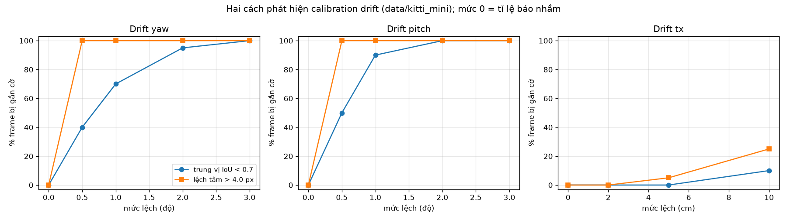
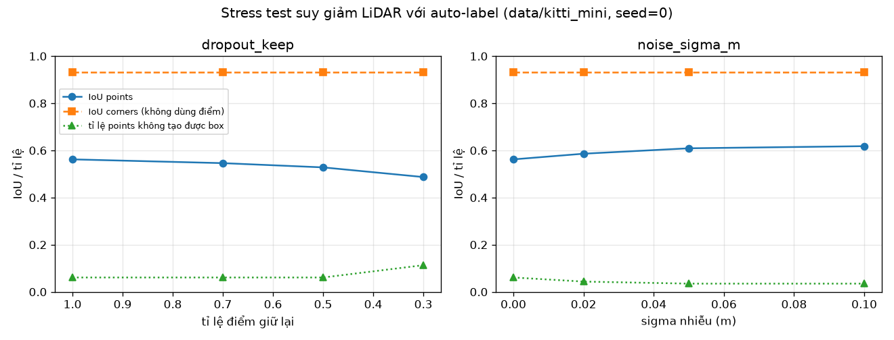
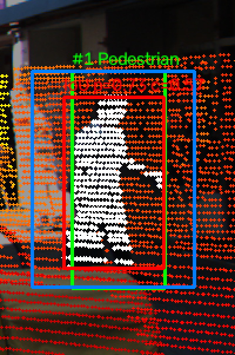
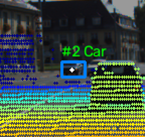

# Báo cáo Day 6: Auto-label 2D box từ box 3D và điểm LiDAR, độ nhạy với calibration drift

- **Họ tên:** Đặng Hữu Tâm
- **MSSV:** 2A202602940
- **Lớp:** AI20K-T4
- **Link repo:** https://github.com/tam253211-a11y/DangHuuTam-2A202602940-Track4-Day21
- **Topic:** F — Auto-label support
- **Dataset:** data/kitti_mini (thí nghiệm chính), data/nuscenes_mini_subset (so sánh, bonus B5), data/synthetic (test CP2)
- **Các frame đã dùng:** toàn bộ 20 frame kitti_mini (000001 … 000061, 115 object), toàn bộ 80 keyframe nuScenes (scene-0103_000 … scene-1094_039, 1193 object)

## 1. Claim

Trên KITTI, 2D box sinh bằng cách chiếu 8 góc box 3D khớp label người vẽ với **IoU trung bình 0.95**, tốt hơn hẳn cách lấy min/max điểm LiDAR trong box (0.56). Nhưng nó rất nhạy với lệch góc: **lệch yaw 1° làm IoU trung bình tụt còn 0.62, vật ≥ 20 m còn 0.52**. Với ngưỡng "trung vị IoU của frame < 0.7", hệ thống gắn cờ **70% frame**, còn dịch ngang 10 cm chỉ gắn cờ 10% frame.

*Claim ban đầu (commit CP1):* "box từ điểm LiDAR khớp label tốt hơn box từ 8 góc". **Đã bị số liệu bác bỏ** (0.56 so với 0.93), vì LiDAR quét thưa và chỉ thấy mặt đối diện. Cách points chỉ thắng ở người đi bộ.

## 2. Evidence

**Bảng 1. Hai cách sinh 2D box so với GT (KITTI, calib đúng, 115 object)** (`results/f_iou_summary_kitti.csv`)

| Nhóm | n | IoU corners (TB) | IoU points (TB) | points không tạo được box |
|---|---|---|---|---|
| Tất cả | 115 | **0.933** | 0.562 | 6.1% |
| < 15 m | 33 | 0.941 | 0.746 | 0% |
| 30–50 m | 29 | 0.948 | 0.440 | 10.3% |
| > 50 m | 13 | 0.965 | 0.294 | 30.8% |
| occluded = 2 | 23 | 0.957 | 0.370 | 17.4% |
| Pedestrian | 18 | 0.733 | 0.646 | 0% |

Box từ points luôn **nhỏ hơn** GT. Lý do: LiDAR quét theo từng tia rời rạc, chỉ thấy mặt đối diện, và lớp 10 cm sát mặt đường bị bỏ. Cách points chỉ thắng ở Pedestrian (33% object), vì box 3D của người rộng hơn thân người.

**Bảng 2. Calibration drift (110 object có IoU corners ≥ 0.7 khi calib đúng, ngưỡng flag 0.7)** (`results/f_perturb_sweep_kitti.csv`)

| Drift | IoU corners TB | < 20 m | ≥ 20 m | % object bị flag | % frame bị flag |
|---|---|---|---|---|---|
| không | 0.947 | 0.942 | 0.950 | 0.0 | 0 |
| yaw 0.5° | 0.767 | 0.860 | 0.704 | 31.8 | 40 |
| yaw 1° | 0.616 | 0.767 | 0.515 | 56.4 | 70 |
| yaw 2° | 0.408 | 0.608 | 0.275 | 80.9 | 95 |
| yaw 3° | 0.293 | 0.498 | 0.155 | 90.0 | 100 |
| pitch 1° | 0.585 | 0.763 | 0.466 | 68.2 | 90 |
| tx 5 cm | 0.923 | 0.919 | 0.926 | 1.8 | 0 |
| tx 10 cm | 0.882 | 0.884 | 0.881 | 5.5 | 10 |


- **Lệch góc** dịch mọi điểm một lượng pixel cố định, nên vật xa (box nhỏ) mất IoU nhanh hơn.
- **Lệch tịnh tiến** cho độ dịch pixel và kích thước box cùng tỉ lệ 1/khoảng cách, nên IoU gần như không phụ thuộc khoảng cách.
- **Chạy lại:** không dùng phép ngẫu nhiên nào; chạy 2 lần cho ra file CSV giống hệt từng byte.

**[B1] So sánh 2 cách phát hiện calibration drift trên cùng 20 frame và 110 object** (`results/f_perturb_sweep_kitti.csv`, cột `frame_flag_pct` và `frame_flag_pct_offset`)

- **Cách 1, IoU:** gắn cờ frame khi trung vị IoU corners < 0.7.
- **Cách 2, lệch tâm:** gắn cờ khi trung vị độ lệch tâm có dấu (Δu, Δv) giữa box corners và box GT, lấy độ lớn, vượt 4 px.

| Drift | % frame bị flag: IoU | % frame bị flag: lệch tâm | trung vị lệch tâm (px) |
|---|---|---|---|
| không (= báo nhầm) | 0 | **0** | 0.4 (tối đa 2.3) |
| yaw 0.5° | 40 | **100** | 6.3 |
| yaw 1° | 70 | **100** | 12.9 |
| pitch 0.5° | 50 | **100** | 6.6 |
| tx 5 cm | 0 | 5 | 1.3 |
| tx 10 cm | 10 | 25 | 2.9 |



- **Ưu điểm của cách lệch tâm:** sai lệch của người gán nhãn lệch ngẫu nhiên quanh 0 nên triệt tiêu khi lấy trung vị, còn drift góc làm mọi box lệch **cùng hướng** khoảng f·tanθ px. Vì vậy tín hiệu không bị box lớn của xe gần che đi như IoU (failure F1). Với yaw 0.5°, cách này bắt được 100% frame mà không báo nhầm frame nào.
- **Nhược điểm của cách lệch tâm:** gần như mù với lệch tịnh tiến (10 cm chỉ khoảng 3 px). Ngưỡng 4 px được chọn trên chính 20 frame này (không có tập kiểm tra riêng), nên cần kiểm lại trên dữ liệu khác.
- **Ưu điểm của cách IoU:** dễ hiểu, dùng chung được với QA label. **Nhược điểm:** bỏ sót 60% frame ở 0.5° (failure F1).

**[B2] Stress test suy giảm LiDAR, seed = 0** (`results/f_degrade_kitti.csv`)

| Suy giảm | Mức | IoU points | Số điểm/object (trung vị) | % points không tạo được box | IoU corners |
|---|---|---|---|---|---|
| không | – | 0.562 | 107 | 6.1 | 0.933 |
| random dropout (giữ lại) | 0.7 / 0.5 / 0.3 | 0.546 / 0.528 / 0.487 | 74 / 48 / 28 | 6.1 / 6.1 / 11.3 | 0.933 |
| nhiễu Gaussian σ | 2 / 5 / 10 cm | 0.586 / 0.609 / 0.618 | 107 / 104 / 95 | 4.3 / 3.5 / 3.5 | 0.933 |



- **Dropout:** làm cách points xấu dần; ở mức giữ 30% thì số object hỏng tăng gấp đôi (6.1% lên 11.3%).
- **Nhiễu làm IoU points *tăng*:** điểm bị tản ra nên box từ points to ra, vô tình gần box GT hơn. Đây là một bẫy của lớp Metric: chỉ số đẹp lên trong khi dữ liệu xấu đi.
- **Cách corners không đổi (0.933):** cách này không dùng điểm LiDAR, nên miễn nhiễm với suy giảm của sensor.

**[B5] So sánh 2 dataset, drift yaw** (`results/f_perturb_sweep_kitti.csv`, `results/f_perturb_sweep_nusc.csv`)

| | KITTI (64 beam) | nuScenes (32 beam) |
|---|---|---|
| IoU corners khi calib đúng | 0.947 | 1.000 (do cách tạo GT, xem bên dưới) |
| IoU points khi calib đúng | 0.563 | 0.120 (66.8% object không đủ 5 điểm) |
| IoU corners khi yaw 1° | 0.616 | 0.489 |
| % frame bị flag khi yaw 1° / 0.5° (IoU) | 70 / 40 | 91.2 / 35 |
| Trung vị lệch tâm khi yaw 0.5° / 1° | 6.3 / 12.9 px | 11.6 / 23.2 px |

Vì sao hai dataset cho kết quả khác nhau:
- **2D box "GT" của nuScenes** được loader sinh ra bằng cách chiếu 8 góc box 3D (`starter/nuscenes_io.py:163`). Vì vậy IoU corners = 1 là hiển nhiên, không chứng minh gì. Đây là lỗi lớp Metric.
- **LiDAR 32 beam thưa hơn khoảng 3 lần**, nên mỗi xe chỉ có 1–2 tia quét và box từ points bị dẹt.
- **Tiêu cự nuScenes khoảng 1253 px**, so với 721 px của KITTI. Cùng 1° yaw thì điểm dịch f·tan(1°) ≈ 21.9 px, so với 12.6 px ở KITTI; đo được 23.2 px và 12.9 px. Ảnh cũng rộng hơn (1600 px so với 1242 px), nhưng vật thể cũng to ra theo đúng tỉ lệ tiêu cự. Vì vậy hai yếu tố không bù trừ nhau: **cùng một góc lệch, IoU ở nuScenes tụt mạnh hơn** (0.489 so với 0.616 ở yaw 1°).
- **Trục LiDAR của nuScenes** là x sang phải, y về trước. Vì vậy `pitch`/`tx` của `perturb_extrinsic` ở nuScenes thực chất là roll và dịch về trước. Bảng trên chỉ so yaw.

**[B6] Lỗi cài sẵn tìm được trong `data/synthetic`**

| Lỗi | Frame | Cách phát hiện (kèm số) |
|---|---|---|
| Điểm NaN | mọi frame (22–23 điểm, khoảng 0.1%) | cột `invalid_ratio` của `python -m starter.data_health --data-root data/synthetic` |
| Mất frame, timestamp nhảy cóc | giữa 000002 và 000003 | `training/timestamps.txt`: 0.0, 0.1, 0.2, **0.4**, 0.5; khoảng cách 0.2 s thay vì 0.1 s |
| Mất điểm theo một cung phía trước bên phải | 000003 | ít hơn khoảng 1 700 điểm (22 063 so với khoảng 23 800); histogram azimuth 10° cho thấy cung −40° đến −10° chỉ còn 26–31% số điểm so với 000002 và 000004. `empty_azimuth_bins = 0` **không** bắt được lỗi này vì cung không trống hẳn |

Chưa chắc đây là toàn bộ lỗi cài sẵn. Ví dụ `intensity_mean` giảm dần từ 0.170 xuống 0.153 qua 5 frame, nhưng chưa xác định được đó là lỗi hay biến thiên tự nhiên.

**Demo:** frame 000011 (`results/figures/f_demo_000011.png`). Màu box: GT xanh lá, corners xanh dương, points đỏ; điểm trắng là điểm LiDAR nằm trong box 3D.


## 3. Failure case

### F1. Lệch yaw 1° nhưng frame không bị gắn cờ (lớp Metric)


- **Trường hợp:** KITTI frame 000008 (đông xe), extrinsic lệch yaw 1°, gắn cờ frame khi trung vị IoU corners < 0.7.
- **Quan sát:** ở ảnh dưới, box xanh dương và đỏ của xe #4 và #5 trượt sang trái khỏi box xanh lá, thấy rõ bằng mắt. Nhưng trung vị IoU chỉ giảm từ **0.98 xuống 0.85**, vẫn > 0.7, nên **không bị gắn cờ**. Ở mức 0.5°, **60%** frame KITTI bị bỏ sót theo cách này.
- **Nguyên nhân:** lệch góc dịch mọi điểm khoảng f·tan(1°) ≈ **12.6 px**, bất kể khoảng cách. Frame 000008 toàn xe gần (trung vị 11 m, gần nhất 3.7 m), box rộng 100–400 px, nên dịch 12.6 px vẫn giữ IoU cao. Lỗi nằm ở **cách đo**: IoU tính theo tỉ lệ với kích thước box, nên vật gần che mất tín hiệu drift.
- **Lớp debug:** Metric. Bản thân dữ liệu và calibration được giả lập đúng như ý định; thứ hỏng là chỉ số dùng để phát hiện drift.
- **Cách phát hiện khi chạy thật:** theo dõi **độ lệch tâm box tính bằng pixel** (Δu, Δv), tức độ lệch góc ≈ Δu/f, thay vì IoU; hoặc chỉ tính trên object ≥ 20 m. Cảnh báo khi trung vị độ lệch tâm > 4 px; xem [B1]: cách này bắt được 100% frame lệch 0.5° mà không báo nhầm.

### F2. Box 3D của người đi bộ không khớp 2D box, gây gắn cờ nhầm (lớp Metric / quy ước label)



- **Trường hợp:** KITTI frame 000015, người đi bộ #1 ở 7.6 m, calibration **đúng**.
- **Quan sát:** box corners (xanh dương) rộng hơn hẳn box GT (xanh lá), IoU chỉ **0.57**. Trên toàn bộ Pedestrian, IoU corners trung bình là 0.73, so với 0.97 của Car.
- **Nguyên nhân:** cuboid 3D của người bao cả tay và bước chân, khi chiếu phối cảnh lại phình thêm; người gán nhãn vẽ 2D box bó sát thân. Hai quy ước label khác nhau, không phải label sai.
- **Lớp debug:** Metric. Dùng một ngưỡng IoU chung cho mọi class là sai cách đo.
- **Cách phát hiện khi chạy thật:** đặt ngưỡng theo class, lấy từ phân vị 5% của IoU khi calib đúng (Car khoảng 0.85, Pedestrian khoảng 0.55); theo dõi % object bị gắn cờ theo từng class.

### F3. Vật xa hoặc bị che không đủ điểm LiDAR (lớp Preprocess / sensor)



- **Trường hợp:** KITTI frame 000009, xe #2 ở 68 m, calibration đúng.
- **Quan sát:** chỉ **1 điểm** LiDAR nằm trong box 3D, nên cách points không tạo được box (IoU = 0), trong khi cách corners vẫn đạt 0.98. Toàn KITTI: 30.8% object > 50 m và 17.4% object occluded = 2 không đủ 5 điểm; nuScenes 32 beam: 66.8%.
- **Nguyên nhân:** khoảng cách giữa các tia quét dọc của HDL-64 khoảng 0.4°, ở 68 m tương ứng gần 0.5 m, nên xe cao khoảng 1.5 m chỉ được 2–3 tia chạm vào, phần còn lại bị che hoặc phản xạ yếu.
- **Lớp debug:** Preprocess. Ngưỡng `min_points` và vùng range dùng cho auto-label không khớp với mật độ thật của sensor.
- **Cách phát hiện khi chạy thật:** log số điểm trên mỗi object; object có < 5 điểm thì dùng cách corners hoặc chuyển sang người gán nhãn, không dùng cách points.

## 4. Khuyến nghị nếu triển khai thật

**Use-case 1: QA nhãn trong pipeline gán nhãn ADAS (offline).**
- Sinh 2D box bằng cách corners, so với box người vẽ, đẩy sang review các object có IoU dưới ngưỡng **theo class** (Car 0.85, Pedestrian 0.55; xem F2).
- Cách points chỉ dùng để kiểm "object có thật sự được LiDAR nhìn thấy không" (≥ 5 điểm), không dùng để sinh box vì box luôn hẹp hơn thực tế (mục 2).
- Trước khi QA một batch, chạy bộ phát hiện drift [B1]. Nếu batch bị lệch calib thì mọi IoU đều thấp, nên phải sửa calib trước, không đẩy cả batch sang người gán nhãn.

**Use-case 2: xe giao hàng tự hành trong đô thị, dưới 30 km/h, theo dõi drift của giá đỡ camera–LiDAR.**
- **Khi nào chạy:** mỗi lần xe dừng (đèn đỏ, điểm giao hàng), thay box GT bằng box của detector 2D camera. Tính trung vị độ lệch tâm (Δu, Δv) giữa box chiếu từ 3D và box 2D trên ít nhất 5 object.
- **Ngưỡng:** cảnh báo khi trung vị > **4 px**, tức ≈ 0.3° ở f ≈ 721 px, trong **3 lần dừng liên tiếp**. Ở mục 2, ngưỡng này bắt 100% frame lệch 0.5° mà không báo nhầm frame nào; còn cách IoU chỉ bắt được 40%.
- **Lệch tịnh tiến:** cách này gần như mù với lệch tịnh tiến (10 cm chỉ khoảng 3 px). Nhưng 10 cm cũng chỉ làm IoU giảm từ 0.95 xuống 0.88, ít nguy hiểm hơn lệch góc nhiều, nên ưu tiên giám sát góc của bracket.

**Trade-off:**
- **[B3] Tốc độ:** khoảng **55 ms/frame p50, 75 ms p95** trên CPU (Python thuần, `results/f_latency_kitti.csv`: 20 lần, bỏ lần đầu; AMD Ryzen 5 5500U, RAM 7.3 GB, không GPU). Không đủ để chạy mỗi frame ở 10 Hz cùng với perception, nên chỉ chạy khi xe dừng. Đổi lại, drift xảy ra lúc xe chạy sẽ chỉ được phát hiện ở lần dừng tiếp theo, chậm khoảng 1–2 phút trong đô thị.
- **Độ nhạy và độ ổn định:** chỉ dùng vật ≥ 20 m thì nhạy hơn với lệch góc, nhưng ít object hơn nên trung vị nhiễu hơn.
- **An toàn:** khi có cảnh báo, giảm trọng số fusion camera–LiDAR và chuyển sang chế độ chạy chậm, thay vì dừng hẳn xe.

**Chỉ số cần ghi log:**
- Trung vị Δu, Δv (px) mỗi lần dừng, tách theo dải khoảng cách.
- % object bị gắn cờ theo class.
- Số điểm LiDAR trên mỗi object (< 5 thì bỏ khỏi phép đo).
- Độ lệch timestamp LiDAR–camera.
- Nhiệt độ giá đỡ, để phân biệt lệch do va chạm (nhảy đột ngột) với lệch do giãn nở nhiệt (trôi chậm theo nhiệt độ).

## 5. Cách chạy lại

```bash
pip install -r requirements.txt
# CP2: tự kiểm tra 2 hàm TODO bằng số, rồi demo projection
python -m src.test_projection
python -m starter.projection --data-root data/kitti_mini --frame 000011
python -m starter.projection --data-root data/synthetic --frame 000000 --yaw-deg 2
# Bảng 1 + ảnh overlay từng frame
python -m src.autolabel eval  --data-root data/kitti_mini --figures
# Bảng 2 + plot sweep
python -m src.autolabel sweep --data-root data/kitti_mini
# [B1] so sánh 2 cách phát hiện drift: cột frame_flag_pct_offset + results/figures/f_drift_detector_compare_kitti.png (do lệnh sweep ở trên tạo)
# [B2] stress test dropout/nhiễu (seed=0)
python -m src.autolabel degrade --data-root data/kitti_mini
# [B5] nuScenes
python -m src.autolabel eval  --data-root data/nuscenes_mini_subset --tag nusc
python -m src.autolabel sweep --data-root data/nuscenes_mini_subset --tag nusc
# Demo + failure case
python -m src.autolabel show --frame 000011 --out results/figures/f_demo_000011.png
python -m src.autolabel show --frame 000008 --yaw-deg 1 --compare --label "yaw 1 deg" --out results/figures/fail_02_yaw1deg_undetected_000008.png
python -m src.autolabel show --frame 000015 --obj 1 --crop --out results/figures/fail_01_pedestrian_label_mismatch_000015.png
python -m src.autolabel show --frame 000009 --obj 2 --crop --out results/figures/fail_03_far_car_1point_000009.png
python -m src.autolabel show --data-root data/nuscenes_mini_subset --frame scene-0103_010 --out results/figures/f_demo_nusc_scene-0103_010.png
# [B3] latency (20 lần, bỏ lần đầu)
python -m src.autolabel latency --data-root data/kitti_mini
# [B4] tool dùng lại được: --help cho mọi lệnh con; chạy không tham số = eval trên kitti_mini
python -m src.autolabel --help
python -m src.autolabel sweep --help
python -m src.autolabel
# Ôn lý thuyết Phần 02 bằng số liệu thật
python -m src.theory_check
```

Latency đo trên CPU AMD Ryzen 5 5500U, RAM 7.3 GB, Windows 11, Python 3.13, không dùng GPU. Trên Windows, chạy `$env:PYTHONIOENCODING="utf-8"` trước nếu console báo `UnicodeEncodeError`.

## 6. Khai báo sử dụng AI

| Công cụ | Dùng cho việc gì | Bạn đã kiểm chứng thế nào |
|---|---|---|
| Claude Code (Claude Opus) | Viết 2 hàm TODO trong `starter/projection.py`; viết `src/autolabel.py` (IoU, chọn điểm trong box 3D, sweep perturb, cách phát hiện drift theo lệch tâm, stress test, vẽ hình, CLI), `src/test_projection.py` (theo mẫu codelab), `src/theory_check.py`; dò lỗi cài sẵn trong synthetic; gợi ý cách phân tích và nháp REPORT | Test tay điểm (10,0,0) ra z_cam = 9.727, (u,v) = (614.0, 175.0) đúng như CHECKPOINTS; điểm NaN và điểm sau camera bị loại; xem ảnh overlay để chắc điểm khớp vật thể; chạy lại 2 lần ra CSV giống hệt; tự xem từng ảnh failure để đối chiếu với số liệu |
